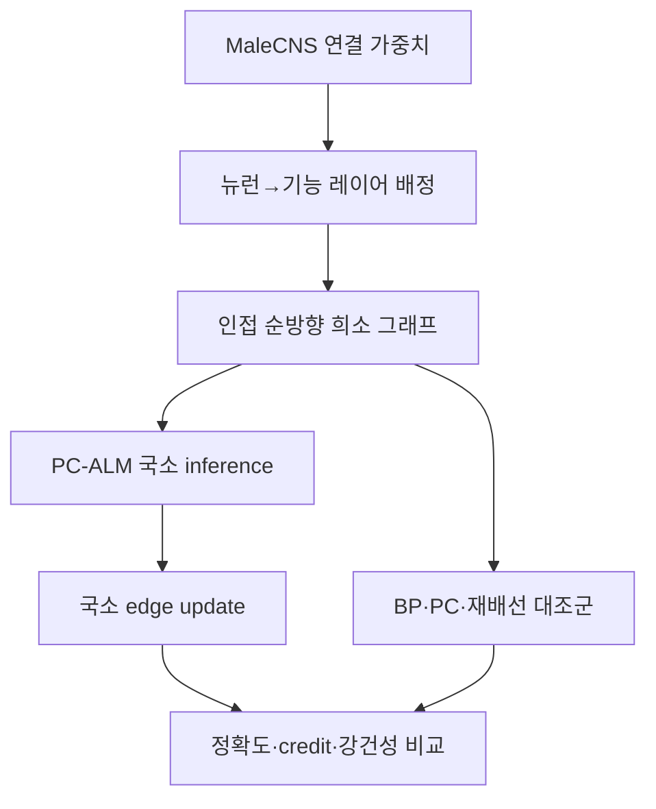

# MaleCNS × PC-ALM

MaleCNS의 실제 연결 토폴로지를 고정된 희소 마스크로 사용하고, 각 모듈이 인접한 모듈의 제약 오차만으로 학습하도록 만든 연구용 프로토타입이다. 핵심 질문은 하나다.

> 실제 초파리 connectome 토폴로지가 같은 크기의 무작위·차수 보존 재배선 그래프보다 국소 학습의 신호 전달, 표본 효율, 손상 강건성을 개선하는가?

이 저장소는 **사전학습 모델이 아니다.** MaleCNS 전체를 학습했다거나 초파리 행동을 재현했다는 결과도 포함하지 않는다. 현재 구현은 그 가설을 통제 실험으로 검증하기 위한 실행 가능한 MVP다.

## 현재 구현 범위

| 항목 | 상태 | 정확한 의미 |
|---|---:|---|
| 희소 connectome 마스크 | 구현 | MaleCNS 연결표의 선택된 뉴런과 인접 레이어 간 연결만 보존 |
| PC-ALM primal–dual inference | 구현 | lifted activation과 레이어별 dual state를 반복 갱신 |
| 레이어 국소 가중치 학습 | 구현 | PC/PC-ALM에서는 각 희소 투영의 제약 에너지를 따로 미분; end-to-end 역전파 없음 |
| 흥분성·억제성 부호 제약 | 구현 | 알려진 presynaptic sign은 softplus 재매개변수화로 학습 중 고정 |
| BP·PC·PC-ALM 비교 | 구현 | 같은 모델·목적함수에서 방법만 교체 가능 |
| 차수 보존 재배선 대조군 | 구현 | 각 이분 레이어의 in/out degree를 유지하는 double-edge swap |
| 시각–운동 3×3 벤치마크 | 구현 | 같은 과제에서 토폴로지 3종×학습법 3종 비교 |
| BP gradient 정렬 지표 | 구현 | readout을 제외한 희소 투영의 gradient cosine 측정 |
| 실제 MaleCNS 전체 166k 규모 학습 | 미검증 | 먼저 1k–5k visual-to-motor 부분 그래프에서 검증해야 함 |
| 시간축/RL credit assignment | 미구현 | 현재 목적함수는 정적 지도학습·모방학습용 MSE |

## 설계

MaleCNS는 순환과 건너뛰기 연결이 많은 방향 그래프인 반면, 공개된 PC-ALM 기준 구현은 순서가 있는 residual MLP를 대상으로 한다. 그래서 이 MVP는 사용자가 뉴런을 `0..N`의 기능적 레이어로 명시적으로 배정한 뒤, 인접한 순방향 연결만 학습 그래프에 넣는다. 삭제되는 연결은 숨기지 않고 `projection-report.json`에 네 종류로 집계한다.



레이어 \(l\)의 연결 제약은

\[
c_l = h_l - f_l(h_{l-1};\theta_l)=0
\]

이고, 학습에 쓰는 augmented Lagrangian은 다음과 같다.

\[
\mathcal L_A = \ell(Wh_L,y)
+ \sum_l \lambda_l^\top c_l
+ \frac{\rho}{2}\sum_l\lVert c_l\rVert^2.
\]

한 미니배치에서 먼저 feed-forward activation으로 \(h_l\)를 초기화한다. 이후 primal state는 \(\mathcal L_A\)를 줄이는 방향으로, dual state는 로컬 residual을 누적하는 방향으로 움직인다.

\[
h_l \leftarrow h_l-\eta_h\nabla_{h_l}\mathcal L_A,
\qquad
\lambda_l \leftarrow \lambda_l+\alpha c_l.
\]

settling이 끝난 뒤 \(h\)와 \(\lambda\)를 detach한다. 각 투영 \(\theta_l\)은 자기 제약항만 보고 갱신하며, task readout만 출력 손실을 본다. PyTorch autograd는 이 **개별 로컬 스칼라**를 미분하는 도구로만 사용한다. PC/PC-ALM 경로에서 전체 레이어 체인을 따라가는 `.backward()`는 호출하지 않는다. BP 대조군만 일반적인 end-to-end 역전파를 사용한다.

공개된 Sakana AI 기준 구현과 같은 방식으로 batch-mean 에너지의 state gradient에 batch size를 곱해 per-sample activity step을 복원한다. `alpha=0`, `inner_steps=1`인 PC-ALM이 같은 budget의 PC와 일치하는지는 테스트로 고정했다.

## 빠른 시작

Python 3.10 이상과 [uv](https://docs.astral.sh/uv/)를 권장한다.

```bash
git clone https://github.com/sjskoko/male-cns-pcalm.git
cd male-cns-pcalm
uv sync --extra dev
uv run pytest
uv run flypcalm smoke --method pcalm --device cpu
```

BP와 표준 PC도 같은 smoke task에서 실행할 수 있다.

```bash
uv run flypcalm smoke --method bp
uv run flypcalm smoke --method pc
uv run flypcalm smoke --method pcalm
```

설정 파일을 사용한 실험은 다음과 같다.

```bash
uv run flypcalm train \
  --config configs/synthetic-pcalm.yaml \
  --output-dir results/synthetic-pcalm
```

각 실행은 `summary.json`과 epoch별 `metrics.csv`를 만든다. 현재 synthetic task는 고정 teacher network가 만든 class를 학생 모델이 모방하는 검증용 문제다. 실제 시각 입력이나 행동 데이터라고 해석하면 안 된다.

### 가상 시각–운동 벤치마크

MaleCNS 파일이 없어도 추천 실험의 전체 실행 경로를 검증할 수 있다.

```bash
uv run flypcalm benchmark \
  --config configs/benchmarks/virtual_visual_motor.yaml \
  --output-dir results/virtual-visual-motor
```

이 명령은 고정된 4-class 시각–행동 과제에서 `native·degree_preserving·random` 토폴로지와 `BP·PC·PC-ALM`을 교차한 9개 조건을 실행한다. `report.md`, `aggregate.csv`, `trials.csv`, `metrics.csv`, `result.json`이 생성된다. 가상 모드는 synthetic retinotopic graph를 사용하므로 MaleCNS 결과로 해석하지 않는다. 정확한 프로토콜과 실제 데이터 전환법은 [`docs/VISUAL_MOTOR_EXPERIMENT.md`](docs/VISUAL_MOTOR_EXPERIMENT.md)에 있다.

## MaleCNS 데이터 준비

공식 [MaleCNS 다운로드 페이지](https://male-cns.janelia.org/download/)에서 다음 파일을 받는다.

- `connectome-weights-male-cns-v1.0-minconf-0.5.feather`: 전체 segment-to-segment 연결 그래프
- `body-annotations-male-cns-v1.0-minconf-0.5.feather`: 뉴런 class/type/side 등의 주석
- `body-neurotransmitters-male-cns-v1.0.feather`: 뉴런별 neurotransmitter 예측

원본 대용량 파일은 저장소에 커밋하지 않는다. `data/`는 `.gitignore`에 포함돼 있다.

### 1. 명시적 레이어 배정표 만들기

`assignments.csv`는 다음 열을 가져야 한다.

| 열 | 의미 |
|---|---|
| `body_id` | MaleCNS segment/body ID |
| `layer` | 0에서 시작하는 연속 정수; 감각 입력→중간 처리→하행/운동 순서 |
| `module` | 사람이 읽을 수 있는 모듈 이름 |
| `sign` | 선택 열; 흥분성 `+1`, 억제성 `-1`, 불명 `0` |
| `input_position` | 선택 열; 입력층 뉴런의 좌우 시야 위치 `-1..+1` |

작은 형식 예시는 `examples/neuron_layers.csv`에 있다. 실제 연구에서는 주석의 `class`, `type`, ROI와 neurotransmitter 표를 이용해 아래처럼 4–8개 레이어를 먼저 만드는 편이 안전하다.

1. visual/sensory input
2. visual projection and local processing
3. central-complex or mushroom-body association
4. descending control
5. VNC motor output

이 배정은 생물학적 가정 자체이므로 반드시 버전 관리하고, 결과 논문에서는 포함/제외 규칙을 공개해야 한다.

### 2. 희소 레이어 그래프로 투영

```bash
uv run flypcalm prepare \
  --edges data/raw/connectome-weights-male-cns-v1.0-minconf-0.5.feather \
  --assignments data/assignments/visual-motor.csv \
  --min-weight 5 \
  --output data/processed/malecns-visual-motor.pt \
  --report results/projection-report.json
```

입력 열 이름은 공식 MaleCNS 형식인 `body_pre`, `body_post`, `weight`를 우선 인식하며 흔한 별칭도 지원한다. 연결 강도는 `log1p(weight)` 후 postsynaptic neuron별 L2 정규화로 초기화한다. 알려진 sign은 presynaptic neuron에 적용된다.

보고서의 핵심 수치는 다음과 같다.

- `retained_adjacent_forward_edges`
- `dropped_intra_layer_edges`
- `dropped_feedback_edges`
- `dropped_skip_forward_edges`
- `edges_with_both_nodes_assigned`

건너뛰기·피드백 연결 비율이 높으면 해당 레이어링은 원 그래프를 과도하게 왜곡한 것이다. 그때는 모듈 배정을 바꾸거나 recurrent/equilibrium 확장으로 넘어가야 한다.

### 3. 부분 그래프 학습

`configs/malecns-pcalm.yaml`의 `connectome` 경로를 맞춘 뒤 실행한다.

```bash
uv run flypcalm train \
  --config configs/malecns-pcalm.yaml \
  --output-dir results/malecns-pcalm-seed0
```

주의: 현재 `train` 명령도 synthetic teacher imitation을 사용한다. 따라서 이 명령은 **실제 MaleCNS 토폴로지에서 학습 코드가 작동하는지** 검증하지만, 생물 행동 성능을 측정하지는 않는다. 실제 실험의 다음 단계는 영상→행동 데이터셋 또는 expert policy trajectory를 `x,target` loader로 연결하는 것이다.

## 필수 대조 실험

최소한 아래 여섯 조건을 같은 데이터 split, parameter budget, seed로 비교해야 한다.

| 토폴로지 | 학습법 | 묻는 질문 |
|---|---|---|
| MaleCNS | BP | topology가 일반 역전파에서도 유용한가? |
| MaleCNS | PC | dual state가 없는 predictive coding의 기준 성능은? |
| MaleCNS | PC-ALM | 제안 조합의 성능은? |
| degree-preserving rewired | PC-ALM | 단순 degree 분포가 아닌 실제 배선에 이점이 있는가? |
| random sparse | PC-ALM | sparsity만으로 설명되는가? |
| dense/residual MLP | BP | 표준 신경망 대비 절대 성능은? |

현재 설정에서 `rewire: degree_preserving`을 추가하면 차수 보존 대조군을, `rewire: random`을 추가하면 레이어 크기와 edge 수만 같은 무작위 대조군을 만든다. 여러 실험은 두 GPU에 한 프로세스씩 독립 실행하는 것이 가장 단순하다.

```bash
CUDA_VISIBLE_DEVICES=0 uv run flypcalm train --config configs/run-a.yaml --output-dir results/a &
CUDA_VISIBLE_DEVICES=1 uv run flypcalm train --config configs/run-b.yaml --output-dir results/b &
wait
```

이 코드는 아직 한 실험을 여러 GPU로 분산하지 않는다. RTX 4090 두 장이라면 우선 1k–5k 뉴런 부분 그래프, 4–8개 레이어, 3–5개 seed로 시작하고 메모리·settling 안정성을 확인한 뒤 10k 이상으로 확장하는 편이 현실적이다.

권장 지표는 task accuracy/return, 표본 효율, 레이어별 residual과 dual norm, BP gradient와의 cosine similarity, wall-clock/memory, edge/뉴런 lesion 후 성능, sign 위반 수다. 현재 벤치마크는 loss·accuracy·residual·dual·gradient cosine·실행 시간을 기록한다. lesion sweep은 다음 구현 단계다.

## 코드 구조

```text
src/flypcalm/
  connectome.py   직렬화 가능한 희소 레이어 그래프
  data.py         MaleCNS 연결표 투영과 손실 연결 보고서
  model.py        고정 마스크·부호 제약 희소 신경망
  pcalm.py        PC/PC-ALM inference와 국소 parameter update
  synthetic.py    synthetic graph와 차수 보존 재배선
  experiment.py   재현 가능한 teacher-imitation 실험
  benchmark.py    topology×learning-rule 실험 러너와 결과 집계
  tasks/          토폴로지와 독립적인 시각–운동 과제
  metrics/        BP 대비 local-gradient 정렬 지표
  cli.py          prepare/train/smoke/benchmark 명령
configs/benchmarks/ 가상 및 MaleCNS 3×3 실험 설정
docs/             실험 프로토콜과 해석 기준
tests/            수식·부호·전처리·재배선·벤치마크 테스트
```

## 알려진 한계

- MaleCNS는 한 마리 성체 수컷의 정적 구조 지도다. spike timing, membrane dynamics, receptor subtype, plasticity rule을 완전히 제공하지 않는다.
- 순환 connectome을 feed-forward 레이어로 투영하는 순간 정보 손실이 생긴다. 보고서로 손실을 계량하지만 제거하지는 못한다.
- PC-ALM은 spatial credit assignment를 다룬다. 긴 시간축의 강화학습 credit assignment가 자동으로 해결되는 것은 아니다.
- GPU에서 반복 settling은 BP보다 느릴 수 있다. 장점은 국소성·분산 가능성이지 즉각적인 wall-clock 우위가 아니다.
- 희소 COO 연산과 lifted state 때문에 전체 166k 뉴런 실행은 아직 검증되지 않았다.
- neurotransmitter 예측은 불확실성을 가진다. `sign=0` 대조군과 confidence threshold 민감도 분석이 필요하다.

## 출처와 라이선스

- Sakana AI, [Augmented Lagrangian Predictive Coding](https://pub.sakana.ai/pc-alm/) 및 [공식 JAX 구현](https://github.com/SakanaAI/pc-alm), arXiv:2605.31022. 공식 구현은 MIT 라이선스다.
- Janelia/협력 연구진, [MaleCNS v1.0](https://male-cns.janelia.org/) 및 [다운로드 문서](https://male-cns.janelia.org/download/). 데이터는 CC BY로 제공된다.

이 저장소의 코드는 위 아이디어를 PyTorch 희소 connectome에 맞게 독립적으로 확장한 MIT 라이선스 구현이다. Sakana AI 저장소의 코드를 복사하지 않았으며, 원 MaleCNS 데이터도 재배포하지 않는다. 연구 결과를 공개할 때는 PC-ALM 논문과 MaleCNS 데이터셋을 함께 인용해야 한다.
