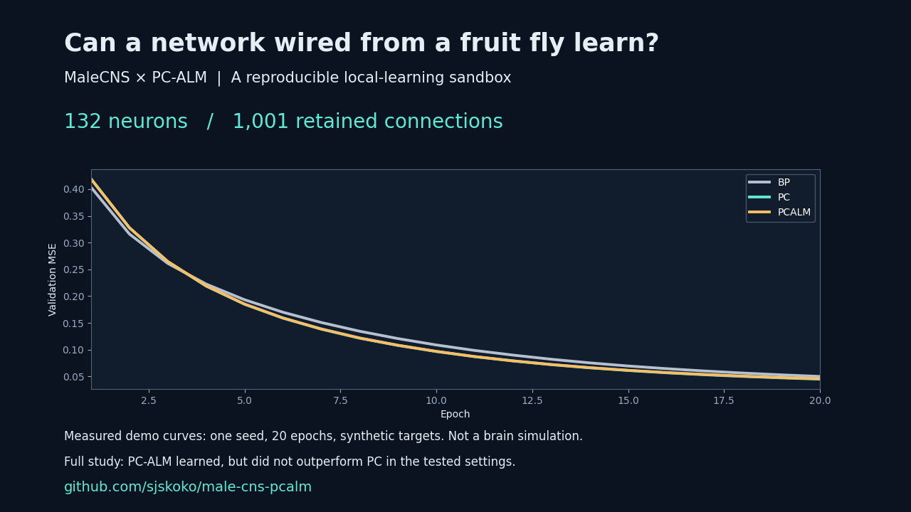

# MaleCNS × PC-ALM

**Can local learning train a network wired from a fruit-fly connectome?**

A reproducible research sandbox for predictive coding and augmented-Lagrangian learning on a real MaleCNS-derived sparse graph. **132 neurons · 1,001 retained connections · 760 training fits.**

[한국어 / original implementation guide](README.ko.md) · [Results](experiments/credit_rebuild/RESULTS.md) · [Matched-rate control](experiments/credit_rebuild/MATCHED_RESULTS.md) · [Contribute](CONTRIBUTING.md)

## Run a small live example

[**Open the CPU notebook in Colab**](https://colab.research.google.com/github/sjskoko/male-cns-pcalm/blob/main/examples/quickstart.ipynb) and choose Runtime → Run all.

It trains BP, PC and PC-ALM for 20 epochs on one paired seed. No GPU or raw-data download is needed. This is a demonstration, not the 760-fit benchmark. The notebook downloads public repository code and installs its dependencies.



[45-second explanatory video](docs/launch/demo.mp4) · [Demo source](examples/launch_demo.py) · [Join the reproduction effort](https://github.com/sjskoko/male-cns-pcalm/issues)

## What we found

PC-ALM learns on this graph, but **did not outperform standard predictive coding in the tested settings**. Better initial gradient alignment did not translate into lower final test error.

| Mean test MSE ↓ | Backpropagation | PC | PC-ALM |
|---|---:|---:|---:|
| Nonlinear synthetic teacher | 0.00582 | 0.01091 | 0.01721 |
| Linear synthetic teacher | 0.37811 | 0.55868 | 0.55755 |

Each primary condition uses 20 paired seeds. Independently selected learning rates differ between methods; a separate matched-rate control found PC-ALM error **1.9–5.1% higher** than PC across four tested conditions. The degree-scaled variant showed no significant benefit.

This is a **research prototype, not a pretrained brain model**. Tasks use synthetic targets, not measured fly behavior. The graph is a feedforward projection: 1,662 of 2,663 selected connections are excluded. These results do not establish that PC-ALM fails generally.

## Try the verification path — CPU only

Python 3.11+. No GPU, PyTorch, or raw connectome download is needed for these checks.

```bash
git clone https://github.com/sjskoko/male-cns-pcalm.git
cd male-cns-pcalm
python -m venv .venv-credit
# macOS / Linux:
source .venv-credit/bin/activate
# Windows PowerShell: .venv-credit\Scripts\Activate.ps1
python -m pip install -r experiments/credit_rebuild/requirements.txt
python -m pytest -q experiments/credit_rebuild/test_study.py
python experiments/credit_rebuild/verify_results.py
```

Expected: **4 mathematical tests pass**, followed by an audit reporting **760 fits**. This verifies the implementation checks and saved records; it does **not** rerun training. The audit refreshes `verification.json`.

To rerun training, follow the [full reproduction guide](experiments/credit_rebuild/README.md#재현). Rebuilding the graph downloads approximately 1.1 GB of official source data. Use a separate working copy for new experiments: the study scripts write results beside the code.

## Why this repository is useful

- Compare BP, PC, PC-ALM, degree-scaled ALM, and shuffled scaling on the same fixed graph.
- Inspect a small, independent NumPy implementation with finite-difference tests.
- Audit frozen settings, paired seeds, per-run metrics, and source-data checksums.
- Investigate a concrete question: **when does improved local gradient alignment help—or fail to help—learning?**

The 760 fits comprise 400 development fits, 200 primary evaluation fits, and 160 secondary matched-rate fits—not 760 independent final replications.

## Start here

| Goal | File |
|---|---|
| Understand the executed algorithm | [study.py](experiments/credit_rebuild/study.py) |
| Inspect the pre-evaluation design | [PROTOCOL.md](experiments/credit_rebuild/PROTOCOL.md) |
| Review results and limitations | [Korean discussion](experiments/credit_rebuild/DISCUSSION_KO.md) |
| Check prior work and claim boundaries | [Literature and claims](experiments/credit_rebuild/LITERATURE_AND_CLAIMS.md) |
| Explore the older PyTorch / topology study | [Original guide](README.ko.md) |
| Propose an experiment or report a reproduction | [Contributing](CONTRIBUTING.md) |

The current NumPy learning-rule study and the older PyTorch topology study are separate implementations. Do not combine their numerical results.

## Help answer the next question

Useful contributions include independent reproduction reports, a tutorial that does not overwrite published results, broader stability sweeps on fresh seeds, and recurrent-graph extensions. See the [roadmap](ROADMAP.md) for acceptance criteria.

If this sandbox is useful to your research, consider starring it so you can find it again. Reproductions, critical feedback, and well-controlled negative results are equally welcome.

## Attribution and license

Code: [MIT](LICENSE). MaleCNS source data and derived connectivity retain their upstream data terms; the code license does not replace those terms.

- [Sakana AI PC-ALM](https://pub.sakana.ai/pc-alm/) and [reference implementation](https://github.com/SakanaAI/pc-alm).
- [MaleCNS dataset and download documentation](https://male-cns.janelia.org/download/).
- [Prior work and scientific claims](experiments/credit_rebuild/LITERATURE_AND_CLAIMS.md).

Independent project; not an official Sakana AI or Janelia release. When using it in research, cite the upstream work and identify the exact repository commit.
