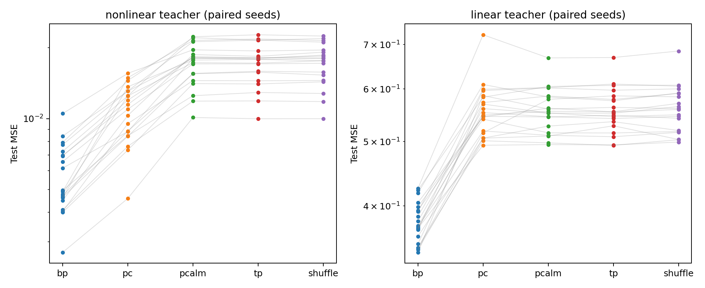
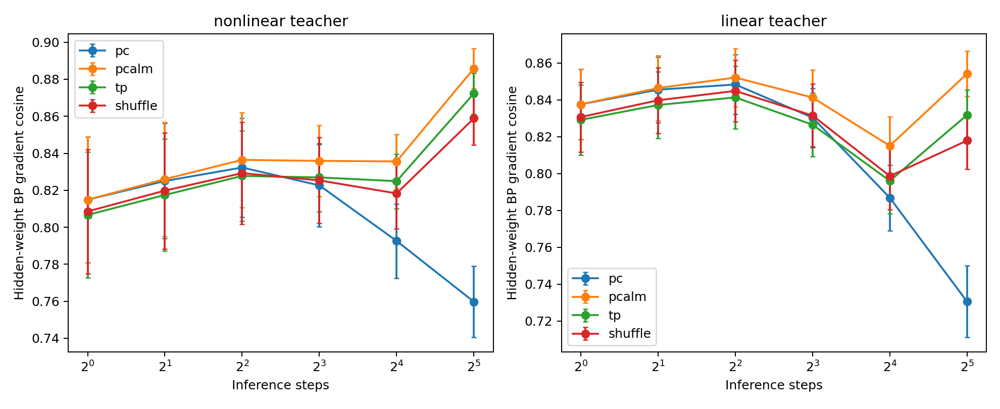

# MaleCNS 위 PC-ALM 학습 검증: 새 실행

이 실험은 초파리 배선의 효율성이 아니라, 고정된 실제 배선에서 PC-ALM의
학습 성능과 국소 기울기 전달을 검증한다. 분실된 과거 실험의 복원이 아닌
독립 재구현·새 실행이다. 과거 24.1%/30.6% 개선 수치는 재사용하지 않는다.

## 이번 실행의 결론

개발 400회 + 주 평가 200회 + 동일 학습률 추가 평가 160회, 총 760회를 완료했다.
PC-ALM은 학습하지만 이번 설정에서는 PC 대비 성능 개선을 확인하지 못했다.
주 평가의 비선형 과제에서는 PC-ALM MSE가 PC보다 57.8% 높았고, 선형 과제는
유의한 차이가 없었다. 학습률 차이를 제거한 별도 비교에서도 PC-ALM의 오차가
1.9~5.1% 높았다. TP 차수 보정의 유의한 이점도 없었다.

이 결과는 이 회로·과제·60에포크·8회 추론·설정 범위에 대한 결론이며,
PC-ALM 일반의 실패나 삭제된 과거 실험의 정확한 재현 결과를 뜻하지 않는다.
자세한 해석은 [DISCUSSION_KO.md](DISCUSSION_KO.md)를 참고한다.




## 재현

저장소 루트에서 Python 3.11+를 사용한다. 기존 루트 PyTorch 패키지와 독립적이다.

```bash
python -m venv .venv-credit
. .venv-credit/bin/activate
pip install -r experiments/credit_rebuild/requirements.txt
bash experiments/credit_rebuild/download.sh
python experiments/credit_rebuild/study.py prepare
python -m pytest -q experiments/credit_rebuild/test_study.py
OPENBLAS_NUM_THREADS=1 OMP_NUM_THREADS=1 python experiments/credit_rebuild/study.py tune
OPENBLAS_NUM_THREADS=1 OMP_NUM_THREADS=1 python experiments/credit_rebuild/study.py run
OPENBLAS_NUM_THREADS=1 OMP_NUM_THREADS=1 python experiments/credit_rebuild/matched_rates.py
python experiments/credit_rebuild/verify_results.py
python experiments/credit_rebuild/figures.py
```

`checkpoints/`는 각 실행을 저장하며 같은 명령을 다시 실행하면 이어서 진행한다.
설정이나 코드를 바꾼 새 실험에는 별도의 작업 사본과 빈 checkpoints 디렉터리를
사용해야 한다. 기존 결과를 덮어쓰며 유리한 결과만 선택해서는 안 된다.

## 설계와 결과 파일

- [PROTOCOL.md](PROTOCOL.md): 실행 전 고정한 설계와 가설
- [RESULTS.md](RESULTS.md): 이번 실행에서 자동 생성한 결과
- `frozen.json`: 개발용 시드로 선택한 설정과 코드/회로 SHA-256
- `development.csv`: 400개 개발 실행의 검증 오차
- `trials.csv`: 200개 최종 실행의 개별 결과
- `comparisons.json`: 여섯 사전 지정 비교, 양측 검정과 Holm 보정
- `alignment.csv`: 초기 가중치에서 추론 횟수별 BP 기울기 정렬
- `curves.csv`: 에포크별 검증 오차 (테스트 데이터로 모델 선택하지 않음)
- `all_selected_edges.csv`, `manifest.json`: 실제 연결과 데이터 출처
- [MATCHED_RESULTS.md](MATCHED_RESULTS.md): 새 시드에서 동일 학습률로 비교한 추가 실험
- `verification.json`: 760회 실행 수, 고정 설정, 짝지은 초기화 및 유한한 지표 검증

## 해석 범위

132개 뉴런 사이 2,663개 연결 중 인접 순방향 1,001개만 사용한다.
반복·층내·건너뛰기 연결 1,662개는 제외한다. 알려진 신경전달물질 부호는
고정하고, 불확실한 22개 뉴런의 부호는 강제하지 않는다. 이는 생체 신호나
초파리의 전체 재귀 뇌를 재현한 모델이 아니다.

학습용 정답은 두 종류의 합성 교사에서 생성한다. 따라서 좋은 결과가 나와도
생물학적 타당성, 실제 행동 예측, 다른 회로로의 일반화를 입증하지 않는다.
TP의 차수 보정은 연구 가설이며, 세계 최초 또는 논문 게재 가능성을 단정하지 않는다.

## 국소 학습식

숨은 층 제약 r=h-tanh(h_prev W), z=r/s에 대해
L = 0.5||prediction-y||² + Σ(lambda·z + 0.5||z||²).
각 층은 q=lambda/s+r/s²와 인접 층 신호로 활동을 동시에 갱신한다.
T-1회 primal/dual 갱신 뒤 마지막 primal 갱신만 수행하고, 그 상태에서
각 층 가중치를 국소적으로 갱신한다. PC는 lambda=0; PC-ALM은 s=1;
TP는 s=clip((in_degree/median_degree)^0.25, .75, 1.5)이다.
역전파는 비교 및 정렬 측정에만 사용한다. 다만 국소식은 인접 가중치의
전치 접근을 사용하므로 생물학적 weight transport 문제를 해결하지 않는다.

출처: [PC-ALM 원 논문](https://arxiv.org/abs/2605.31022),
[MaleCNS 원자료](https://male-cns.janelia.org/download/).
원자료 및 그 파생 연결은 MaleCNS의 CC BY 조건을 따르며 코드 라이선스와 구분한다.
